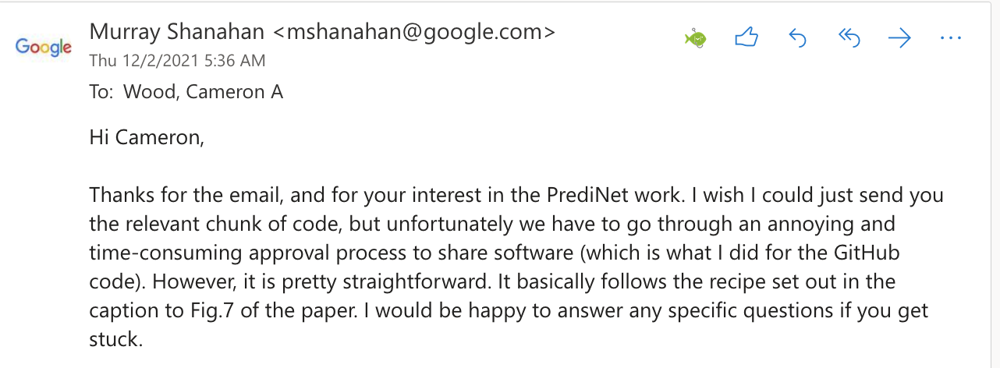

# Working with the output of PrediNet


## My Contributions

I have downloaded the [PrediNet](https://github.com/deepmind/deepmind-research/tree/master/PrediNet) architecture as well as the test sets. The paper references exporting the PrediNet output as a Prolog program but I couldn't find the code to do this. So, I emailed the author, Prof. Murray Shanahan, wondering about this and his response is provided at the very bottom of this README.

He was under the impression that the code to get the prolog program output was straightforward to write out for PrediNet. Though, I don't think he realized how naive my understanding of pytorch and Neural Networks is.

I decided to manually write out an "expected output" of PrediNet in a prolog program called `predioutput.py`. To be clear, I wrote these only based off Figure 7 in the paper.


## Run Prolog Code

To run this, you must have [Prolog](https://www.tutorialspoint.com/prolog/prolog_introduction.htm). I used [SWI-Prolog](https://www.swi-prolog.org/) since I'm on MacOS but the environment should look similar in both. After installing Prolog, one can run import my predioutput.pl program and run the following (in this directory):

```
?- [predioutput].
true.
```

 - Here's an example of my running queries:

```
?- holds(R,V,ob_2,X), large(V).
R = r6,
V = 1.0,
X = ob_0 .

?- holds(R,V,ob_2,X), large(V).
R = r6,
V = 1.0,
X = ob_0 .

?- holds(R,V,ob_2,X), small(V).
R = r0,
V = -0.15,
X = ob_3 .

?- holds(R,V,ob_2,X), small(V).
R = r0,
V = -0.15,
X = ob_3 ;
R = r0,
V = -0.07,
X = ob_0 ;
R = r3,
V = 0.06,
X = ob_0 ;
R = r4,
V = -0.01,
X = ob_4 .
```

## Run PrediNet Code

Honestly, it's better off if you just use google collab and run the PrediNet.ipynb in that environment. Trying to run this locally would be pretty challeneging. I've also saved the output of PrediNet.py if you'd like to see that.


## Email Response

---

###### ETC.
authors: Cameron Wood (@cameronwood611)

tags: PrediNet, classical-AI, predicate-calculus